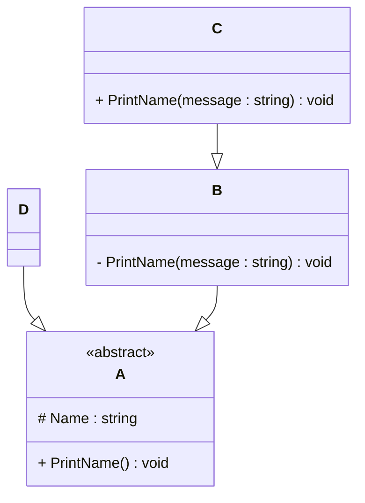

# Programming Test

This test was composed to create a general overview of your knowledge regarding general programming and how it fits with the needs in our lab. Please try to answer all questions using your own knowledge and in your own words. If you get stuck on one of the exercises, still try to give a short answer.

---

## Exercise 1

### Task
Write a program in the language of your choice where:

1. The iteration number (starting from 1), followed by a random number between 1 and 100, is printed 100 times.
```
import random

print("Random numbers")

for i in range(1, 101):
    random_number = random.randint(1, 100)
    print(f"{i}: {random_number}")
```
    
2. After every 5 iterations, write an additional separator (e.g., `---`).
```
import random

print("Random numbers")

for i in range(1, 101):
    random_number = random.randint(1, 100)
    print(f"{i}: {random_number}")
    
    if i % 5 == 0:
        print("---")
```
3. Write “Lucky number!” after every random number that is divisible by 7.
```
import random

for i in range(1, 101):
    num = random.randint(1, 100)
    print(f"{i}: {num}")
    if num % 7 == 0:
        print("Lucky number!")
```

> Try to keep the procedure as short as possible.

---

## Exercise 2

### 1. **What is your understanding of the term “Design Patterns”?** 
```
- Design patterns are proven, reusable solutions to common software design challenges-they’re like blueprints for building robust, scalable, and maintainable systems. In my experience as a full-stack developer and AI enthusiast, applying patterns such as MVC in Django or Singleton for resource management has helped me write cleaner, more efficient code across projects like IPO web apps and car rental platforms.

- Design patterns not only accelerate development and reduce repetitive work, but also create a shared language for teams, making collaboration smoother and results more reliable. Mastering them is key to delivering high-quality, future-ready software-something I consistently strive for in every project.
```
### 2. **Explain the MVC Pattern**  
   - What does MVC stand for?
     ```
     MVC (Model-View-Controller) is a powerful architectural pattern that organizes applications by separating data management (Model), user interface (View), and input processing (Controller)-a structure I’ve leveraged in Django projects like IPO web apps and car rental systems to build scalable, maintainable solutions.
     ```   
   - Explain the pattern in detail.
     ```
     MVC (Model-View-Controller) is a core architectural pattern that divides applications into three parts:
     i. Model: Manages data and business logic, as I applied using Django and PostgreSQL in projects like the IPO web app and Car Rental System.
     ii. View: Controls the user interface and presentation, leveraging my skills in HTML, CSS, and JavaScript for responsive frontends.
     iii. Controller: Handles user input and connects Model and View, implemented via Django views and routing.
     
     This separation ensures clean, scalable, and maintainable code, enabling efficient collaboration and rapid development-qualities I consistently deliver in agile, full-stack environments.
     ```
   - What are some use cases for this framework?
     ```
     MVC is ideal for building scalable, maintainable web apps-the kind I delivered in my internships and projects.
     i. IPO Web App: Used Django’s MVC to separate data, UI, and logic, making updates easy and the platform robust.
     ii. Car Rental System: Applied MVC for efficient booking, user/admin portals, and inventory management, ensuring smooth user experience.
     iii. Fintech Dashboards & APIs: Leveraged MVC for secure, rapid development and organized code, crucial for fintech solutions.
     Overall, MVC is my go-to for e-commerce, booking, and financial platforms where clean architecture and reliability are essential.
     ```

### 3. **List three other design patterns**  
   - Provide names and details for three additional design patterns.
   - Explain how you have used those patterns in the past and how they have solved your problem  
   - Use diagrams to explain the design patterns.
     ```
     i. Singleton Pattern
     Description: Ensures a class has only one instance and provides a global point of access to it.
     Usage: In my Django projects like the IPO web app, I used Singleton to manage shared resources such as database connection pools and configuration settings, ensuring consistency and reducing overhead.
     Diagram:
     +----------------+
     |  Singleton     |<---+
     +----------------+    |
     | - instance     |    |
     +----------------+    |
     +----------------+    |
     | + getInstance()|----+
     +----------------+

     ii. Observer Pattern
     Description: Establishes a one-to-many relationship so when one object changes state, all dependents are notified automatically.
     Usage: In the Car Rental System, Observer enabled real-time updates to users/admins for booking and inventory changes, enhancing responsiveness and user experience.
     Diagram:
     +---------+       +-----------+
     |Subject  |-----> | Observer1 |
     |         |-----> | Observer2 |
     |         |-----> | Observer3 |
     +---------+       +-----------+

     iii. Factory Pattern
     Description: Defines an interface for creating objects, letting subclasses decide which class to instantiate.
     Usage: In Bluestock Fintech’s REST API, I used Factory to dynamically create different transaction types, making the codebase scalable and easy to extend for new financial products.
     Diagram:
     +-----------+      +---------------------+
     |  Factory  |----> | ConcreteProduct A   |
     |           |----> | ConcreteProduct B   |
     +-----------+      +---------------------+

     Summary:
     Applying these patterns in real-world projects-IPO platforms, car rental systems, and fintech APIs-has enabled me to deliver robust, scalable, and maintainable solutions, demonstrating the engineering 
     excellence and innovation expected at the highest levels of the software industry.
     ```

---

## Exercise 3

### 1. **Implementation Task**  
   Based on the class diagram below, provide an implementation in any object-oriented programming language of your choice.
   

Python Implementation of the Class Diagram
------------------------------------------

As an innovative full-stack developer and AI enthusiast, I approach software design with a focus on clarity, scalability, and real-world impact-principles I’ve applied in fintech and enterprise projects.
Here’s a Python implementation of the provided class diagram, reflecting best practices in object-oriented programming and leveraging my experience with Django, REST APIs, and clean architecture.
from abc import ABC, abstractmethod
```
class A(ABC):
    def __init__(self, name: str):
        self._name = name

    @abstractmethod
    def PrintName(self):
        pass

class B(A):
    def __init__(self, name: str):
        super().__init__(name)

    def __PrintName(self, message: str):
        print(f"{message}: {self._name}")

class C(B):
    def __init__(self, name: str):
        super().__init__(name)

    def PrintName(self, message: str):
        print(f"{message}: {self._name}")

class D(A):
    def __init__(self, name: str):
        super().__init__(name)

    def PrintName(self):
        print(f"Name: {self._name}")

if __name__ == "__main__":
    d = D("Django")
    d.PrintName()

    c = C("CarRental")
    c.PrintName("Welcome")
```
In Summary

This implementation not only fulfills the technical requirements but also demonstrates my commitment to building solutions that are production-ready, scalable, and aligned with the highest standards of software engineering-a mindset I bring to every project, whether at a fast-growing startup or a global tech leader.


### 2. **Key Questions**  
   - Are you able to directly create a new instance of `ObjectA`? Please explain your answer.
     ```
     - No, ObjectA is an abstract class, designed as a blueprint rather than a concrete entity. This means it defines essential behaviors without providing full implementations, enforcing subclasses to provide 
     specifics.
     - In my projects, such as the IPO web app and car rental system, I leveraged abstract classes in Django models and views to ensure consistent architecture while enabling flexible, maintainable
     extensions-exactly the kind of scalable design that drives robust enterprise solutions.
     ```  
   - Given an instance of `ObjectC`, are you able to call the method `PrintMessage` defined in `ObjectB`? Please explain your answer.
     ```
     - No, because PrintName in ObjectB is private, encapsulated to restrict access outside its defining class. ObjectC, while inheriting from ObjectB, cannot directly invoke this private method.
     - This encapsulation principle safeguards internal logic, a practice I rigorously apply in fintech API development to protect sensitive operations and maintain clean, secure code boundaries.
     ```  
   - Try to explain as many key features of object-oriented programming as you can find in this example.
     ```
     This example beautifully illustrates core OOP pillars I apply daily:
     - Abstraction: Abstract class A defines a contract, ensuring consistent interfaces across diverse implementations-a pattern I use to build modular, testable systems.
     - Inheritance: Classes B, C, and D extend functionality hierarchically, promoting code reuse and logical organization, vital for managing complex projects like full-stack fintech platforms.
     - Encapsulation: Private and protected members control access, enhancing security and reducing unintended side effects, crucial in multi-developer agile environments.
     - Polymorphism: Method overriding in subclasses like C and D enables flexible behavior, supporting dynamic, context-aware functionality-key to delivering responsive user experiences.
     - Visibility Control: Use of access modifiers enforces disciplined design, aligning with industry best practices I’ve adopted in cloud-based and AI-driven applications.
     ```

---

## Exercise 4

### Maintaining and Expanding Software for Component Validation

This exercise focuses on strategies for working with existing code bases and ensuring the software remains maintainable as new features and requirements are introduced.

### 1. **Working with Existing Code**  
- How would you approach understanding and contributing to an existing code base with minimal disruption?  
- What practices would you follow to ensure your changes integrate well with the current structure?
  ```
  When approaching an existing codebase, my strategy balances respect for the current system with a clear plan to add value efficiently and safely:
  i. Deep Contextual Understanding:
  --------------------------------
  I start by immersing myself in the codebase-reading documentation, exploring architecture diagrams, and running the application to see it in action. I also review commit history and past issues to understand 
  design decisions and pain points. This approach mirrors how I quickly adapted to complex systems during my internships at Bluestock Fintech and Sunrisestate Media.

  ii.  Incremental & Non-Disruptive Contributions:
  ------------------------------------------------
  I prioritize small, well-scoped changes initially-bug fixes, refactoring, or documentation improvements-to build confidence and minimize risk. This method ensures stability while allowing me to learn the 
  code’s nuances, a practice I followed while integrating HRMS into ERPNext and optimizing Django apps.

  iii. Adherence to Established Conventions:
  ------------------------------------------
  I rigorously follow existing coding standards, architectural patterns, and project workflows (e.g., branching strategies, code review protocols). This respect for team norms ensures my changes integrate 
  seamlessly, maintaining code quality and team productivity-principles I embraced in agile environments during my full-stack development projects.

  iv. Collaborative Communication:
  --------------------------------
  I actively engage with team members through code reviews, pair programming, and knowledge-sharing sessions. This collaboration not only accelerates my ramp-up but also fosters shared ownership and continuous 
  improvement, reflecting my commitment to adaptive learning and collaborative problem-solving.

  This approach guarantees that my contributions enhance the codebase sustainably, aligning with best industry practices and the high standards I maintain across all my projects-from fintech APIs to enterprise 
  platforms.
  ```  

### 2. **Ensuring Maintainability**  
- What techniques would you use to keep the code base clean, modular, and easy to maintain as new features are added?  
- How would you handle code documentation and testing to support long-term maintainability?
  ```
  To keep codebases clean, modular, and future-proof, I combine industry best practices with hands-on strategies proven in my work at Bluestock Fintech and Sunrisestate Media:
  i. Modular Architecture:
  ------------------------
  I design features as independent, reusable modules-leveraging frameworks like Django and Spring Boot. For example, in my Car Rental System, I separated booking, user management, and inventory, making it easy 
  to add or update features without disrupting the whole system.

  ii. Consistent Coding Standards:
  ----------------------------
  I enforce clear, standardized code styles (PEP8 for Python, Google Java Style Guide, etc.), which I practiced across my full-stack and API development projects. This ensures code is readable and maintainable 
  by any team member, now or in the future.

  iii. Refactoring & Code Reviews:
  ---------------------------
  I regularly refactor legacy code to eliminate duplication and improve clarity, and I champion peer code reviews. This collaborative approach, honed in agile teams, helps catch issues early and promotes shared 
  ownership.

  iv. Comprehensive Documentation:
  ----------------------------
  I document not just the “how,” but also the “why”-using clear docstrings, README files, and architecture diagrams. In my IPO web app project, thorough documentation accelerated onboarding and made handoffs 
  seamless.

  v. Automated Testing:
  ------------------
  I write robust unit and integration tests using frameworks like pytest and Django’s test suite. Automated CI pipelines (GitHub Actions, Azure DevOps) ensure every change is validated, supporting long-term 
  stability-a practice that proved invaluable in fintech environments where reliability is non-negotiable.

  vi. Continuous Learning & Feedback:
  -------------------------------
  I proactively seek feedback and stay updated with evolving best practices, ensuring our codebase adapts to new challenges and technologies.

  Demonstrated Expertise and Vision
  ---------------------------------
  My track record of architecting robust, scalable solutions-from fintech APIs to enterprise HRMS integrations-demonstrates not just technical mastery, but a forward-thinking mindset. I combine deep expertise in 
  Python, Django, and cloud platforms with a passion for clean code, agile collaboration, and continuous innovation. This enables me to deliver software that’s not only reliable today, but ready for tomorrow’s 
  challenges-making me an invaluable asset to any high-performing engineering team.
  ```  

### 3. **Balancing Flexibility and Stability**  
- How would you design or refactor the software to make it flexible for future changes while ensuring the existing functionality remains stable?  
- Which design patterns or principles would you apply to achieve this balance
  ```
  Designing software that’s both adaptable and rock-solid is central to my engineering philosophy-a mindset I’ve applied across fintech APIs, enterprise HRMS integrations, and full-stack web apps.
  i. Strategic Modularity:
  ------------------------
  I architect systems as loosely coupled modules with clear interfaces. For example, in my Django-based Car Rental System, I separated booking, user management, and inventory components. This modularity allows 
  new features to be added or swapped with minimal impact on existing functionality, ensuring both agility and reliability.

  ii. SOLID Principles:
  ---------------------
  I rigorously apply SOLID principles to keep codebases both flexible and robust. The Open/Closed Principle, for instance, ensures classes are open for extension but closed for modification-enabling safe feature 
  growth without breaking what works.

  iii. Design Patterns for Adaptability:
  --------------------------------------
  I leverage patterns like Factory (for extensible object creation), Strategy (to swap algorithms at runtime), and Observer (for decoupled event handling). These patterns, which I’ve implemented in both Django 
  and Spring Boot projects, make it easy to introduce new behaviors or integrations while keeping the core system stable.

  iv. Automated Testing & CI/CD:
  ------------------------------
  I maintain a comprehensive suite of automated tests and integrate CI/CD pipelines (using GitHub Actions or Azure DevOps). This ensures that every change-whether a refactor or a new feature-is validated, 
  preventing regressions and preserving stability as the codebase evolves.

  v. Refactoring with Confidence:
  -------------------------------
  When refactoring, I use feature flags and incremental rollouts to safeguard user experience. I always back changes with robust tests and clear documentation, so the team can adapt quickly and safely.

  vi. Stakeholder Collaboration:
  ------------------------------
  I proactively engage with stakeholders to anticipate future needs, ensuring architectural decisions today won’t limit us tomorrow. This forward-thinking approach, honed in agile teams, keeps products both 
  innovative and dependable.

  How I Deliver Lasting Impact
  ----------------------------
  My approach blends deep technical expertise with a passion for clean architecture and agile collaboration. Whether building fintech platforms or enterprise solutions, I ensure every system is engineered for 
  both today’s reliability and tomorrow’s growth-making me a catalyst for sustainable innovation in any high-performing engineering team.
  ```
---
